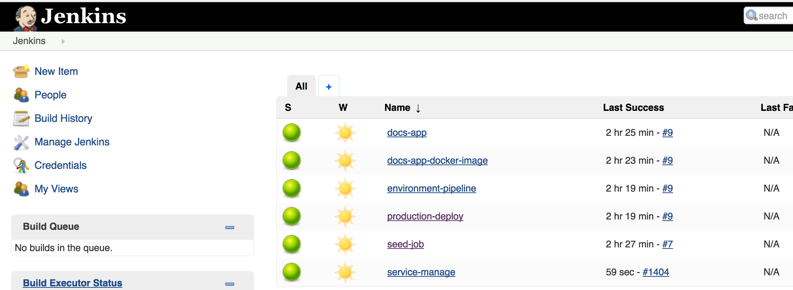

## Sample App

  * [Create Repo](#createrepo)
  * [Configure Bitesize Files](#configurefiles)
  * [Deploy Jenkins](#deployjenkins)

<br>

## Requirements:
  * Existing Kubernetes Cluster with "default" namespace
  * Kubernetes minions have `role=minion` as node label.

This can be added to your workers/minions with
```
kubectl label nodes <node_name> role=minion
```

<a id="createrepo"></a>
### Create a Repo
Create a git repo where you will store .bitesize configuration files. This can be pretty much anywhere. We'll call this the `SEED_JOBS_REPO`. You will need to provide a `GIT_PRIVATE_KEY` for access to the repository from Jenkins. Read-Only access is recommended.
<br><br>


<a id="configurefiles"></a>
### Configure Bitesize files
Now lets setup the config files. We'll add the following files to the repository you just created.

These files are yaml based and will help you get a sample app up and running.

##### environments.bitesize
```
project: docs-dev
environments:
  - name: production
    namespace: docs-dev
    deployment:
      method: rolling-upgrade
    services:
      - name: docs-app
        port: 80 # this is the port number the application responds on in each container/instance/pod
        replicas: 2
```


##### build.bitesize
```
project: docs-dev
components:
  - name: docs-app
    os: linux
    dependencies:
      - type: debian-package
        package: php5
        repository: ppa:ondrej/php
      - type: debian-package
        package: libapache2-mod-php5
      - type: debian-package
        package: python2.7
      - type: debian-package
        package: python-pip
      - type: pip-package
        package: PyGithub
      - type: pip-package
        package: pyyaml
      - type: debian-package
        package: couscous
        location: https://s3.amazonaws.com/bitesize-sandbox-files/couscous.deb_1.0_amd64.deb
    repository:
      git: git@github.com:pearsontechnology/kubecon_docs.git
      branch: master
    env:
      - name: GIT_USERNAME
        value: kubecondemos@gmail.com   # demo git user
      - name: GIT_PASSWORD
        value: 21874b392e38ded25c91a3ecfba57ba384126087    # demo git user token
    build:
      - shell: cat /dev/null > couscous.yml
      - shell: python docsgen.py
      - shell: couscous generate
      - shell: mkdir -p var/www/html
      - shell: cp run.sh var/
      - shell: cp -a .couscous/generated/* var/www/html
      - shell: fpm -s dir -n docswebsite --iteration $(date "+%Y%m%d%H%M%S") -t deb var
    artifacts:
      - location: "*.deb"
```

##### application.bitesize
```
project: docs-dev # aka namespace
applications:
  - name: docs-app
    runtime: ubuntu-httpdfcgi:1.3
    version: "0.8.35"
    dependencies:
      - name: docswebsite
        type: debian-package
        origin:
          build: docs-app
        version: 1.0
    command: "/var/run.sh"
```
<br><br>
<a id="deployjenkins"></a>
### Deploy Jenkins

Substitute the following vars into the config below:<br><br>
${JENKINS_ADMIN_USER} - Jenkins Admin user name<br>
${JENKINS_ADMIN_PASSWORD} - Jenkins Admin password<br>
${SEED_JOBS_REPO}  - location of git repo where bitesize config files exist. Ex.'git@github.com:...'<br>
${GIT_PRIVATE_KEY} - Private SSH key used to access the git repo.


With [Nginx-Controller](#nginxcontroller)
or
Exposed via [Kubernetes Service](#kubernetesservice)

<a id="nginxcontroller"></a>
Nginx Controller Example:
```
apiVersion: extensions/v1beta1
kind: Deployment
metadata:
  labels:
    name: jenkins
  name: jenkins
  namespace: default
spec:
  replicas: 1
  selector:
    matchLabels:
      name: jenkins
  strategy:
    rollingUpdate:
      maxSurge: 1
      maxUnavailable: 1
    type: RollingUpdate
  template:
    metadata:
      labels:
        name: jenkins
      name: jenkins
    spec:
      containers:
      - name: jenkins
        env:
        - name: JAVA_OPTS
          value: -Djava.awt.headless=true -Xms512m -Xmx2g -XX:MaxPermSize=1048M -Dorg.apache.commons.jelly.tags.fmt.timeZone=America/New_York
            -Dcom.sun.management.jmxremote.local.only=false
        - name: JENKINS_ADMIN_USER
          value: ${JENKINS_ADMIN_USER}
        - name: JENKINS_ADMIN_PASSWORD
          value: ${JENKINS_ADMIN_PASSWORD}
        - name: SEED_JOBS_REPO
          value: ${SEED_JOBS_REPO}
        - name: GIT_PRIVATE_KEY
          value: |
                 ${GIT_PRIVATE_KEY}
        - name: MY_POD_IP
          valueFrom:
            fieldRef:
              apiVersion: v1
              fieldPath: status.podIP
        - name: MY_POD_NAME
          valueFrom:
            fieldRef:
              apiVersion: v1
              fieldPath: metadata.name
        - name: MY_POD_NAMESPACE
          valueFrom:
            fieldRef:
              apiVersion: v1
              fieldPath: metadata.namespace
        image: bitesize-registry.default.svc.cluster.local:5000/geribatai/jenkins:3.4.28
        imagePullPolicy: Always
        securityContext:
          runAsUser: 1000
        ports:
        - containerPort: 8080
          protocol: TCP
        - containerPort: 50000
          protocol: TCP
        resources: {}
        terminationMessagePath: /dev/termination-log
        volumeMounts:
        - mountPath: /var/jenkins_home
          name: jenkins-data
        - mountPath: /var/jenkins_home/repository
          name: aptly-repository
      - image: geribatai/aptly:1.0.0
        imagePullPolicy: Always
        name: aptly
        ports:
        - containerPort: 9797
          protocol: TCP
        resources: {}
        terminationMessagePath: /dev/termination-log
        volumeMounts:
        - mountPath: /aptly
          name: aptly-repository
      dnsPolicy: ClusterFirst
      restartPolicy: Always
      securityContext:
        fsGroup: 1000
      terminationGracePeriodSeconds: 30
      volumes:
      - emptyDir: {}
        name: jenkins-data
      - emptyDir: {}
        name: aptly-repository
```


### Expose Jenkins externally

[Using Nginx Controller](#nginxcontroller) OR via [Kubernetes Service](#kubernetesservice)


<a id="nginxcontroller"></a>
<br>
#### Nginx Controller Example:
${JENKINS_HOST} - URL to reach Jenkins interface<br>

```
---
apiVersion: extensions/v1beta1
kind: Ingress
metadata:s
  name: jenkins
  namespace: default
spec:
  rules:
  - host: ${JENKINS_HOST}
    http:
      paths:
      - backend:
          serviceName: jenkins
          servicePort: 80
        path: /
---
apiVersion: v1
kind: Service
metadata:
  labels:
    name: jenkins
  name: jenkins
  namespace: default
spec:
  ports:
  - port: 80
    protocol: TCP
    targetPort: 8080
  selector:
    name: jenkins
---
apiVersion: v1
kind: Service
metadata:
  labels:
    name: apt
  name: apt
  namespace: default
spec:
  ports:
  - port: 80
    protocol: TCP
    targetPort: 80
  selector:
    name: jenkins
```


<a id="kubernetesservice"></a>
#### Kubernetes Service Example:
```
---
kind: Service
apiVersion: v1
metadata:
  labels:
    name: jenkins
  name: jenkins
  namespace: default
spec:
  selector:
    name: jenkins
  ports:
    - name: http
      protocol: TCP
      port: 80
      nodePort: 9376
---
apiVersion: v1
kind: Service
metadata:
  labels:
    name: apt
  name: apt
  namespace: default
spec:
  ports:
  - port: 80
    protocol: TCP
    targetPort: 80
  selector:
    name: jenkins
```


Check if Jenkins is up:
`kubectl get pods --namespace=default`

`jenkins-2316707662-jl0by    2/2       Running   0          23h`


Once jenkins is 'running', access the Jenkins UI through the ${JENKINS_HOST} url or the Kubernetes external service on nodePort with `${JENKINS_ADMIN_USER}` and `${JENKINS_ADMIN_PASSWORD}` and you should see Jenkins working.<br><br>

<br><br>


You shouldn't have to do anything else. Jenkins will build the sample app for you with two replicas.
Once complete you can run - `kubect get pods --namespace=default`

```
docs-app-1004779489-8smwb   1/1       Running   0          2h
docs-app-1004779489-tn4ht   1/1       Running   0          2h
```
